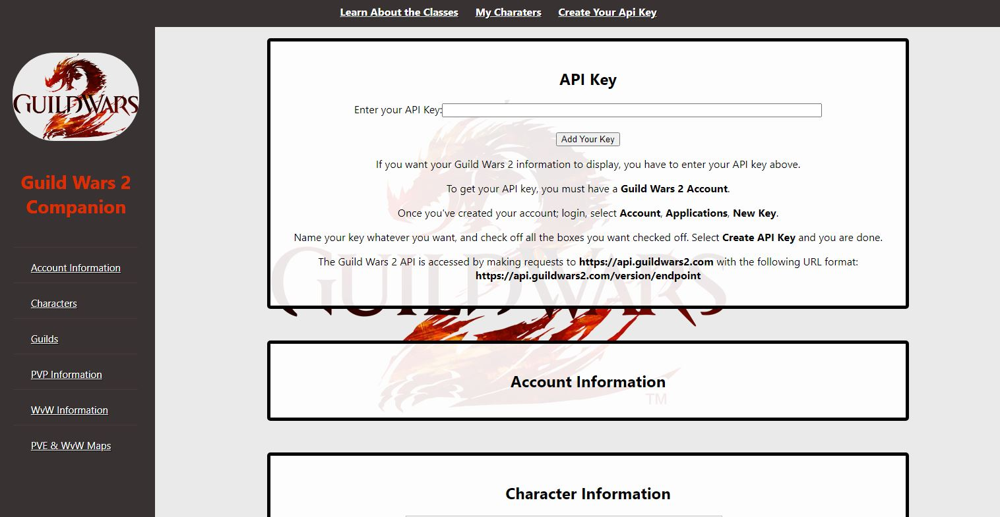

#Guild Wars 2 Companion

Welcome to the Guild Wars 2 Companion Repo! This is a React-based web application developed during the SBA React Project week 10 for Per Scholas. You can access the live site <a href="https://arnaldopires.com/GW2-Companion/">here.</a>

<h3>About the Project:</h3>

This project was created as part of a coding bootcamp assignment focused on web development at Per Scholas.
The primary objective was to develop a React application utilizing any API of our choice. For this project, I decided to harness
the power of the Guild Wars 2 API, my favorite MMORPG game!

<h3>Getting Started</h3>

To use this site, you'll need to enter your API key, which you can obtain by creating an account on the official Guild Wars 2 website. Once you've provided your API key, a wealth of information about your Guild Wars 2 account will be at your fingertips. The information is conveniently organized into various categories, including:

<h4>Account Information</h4>

Explore details about your Guild Wars 2 account, including your account name and ID

<h4>Character Information</h4>

Discover a comprehensive list of all your characters, along with their profession, gender, race, age, created date, death count, and title (if applicable).

<h4>Guilds</h4>

View the guilds you are a part of.

<h4>PVP Stats</h4>

Get insights into your Player versus Player (PvP) performance, including your rank, the number of matches won and lost, and more.

<h4>World Maps</h4>

Explore an interactive map of the Guild Wars 2 game world for both PvE and World vs. World gameplay. Navigate the vast landscapes and immerse yourself in the game's rich environments. All credits for this map goes to ThatShaman!

<h3>Building the Project</h3>

Guild Wars 2 Companion was constructed using CSS and React, resulting in a user-friendly web application. However, building this project presented several challenges.

<h4>Challenges Faced</h4>

One significant challenge was retrieving specific data from the Guild Wars 2 API. For instance, obtaining the server name required multiple API calls. Initially, the API provided an ID number for the world instead of its name. To overcome this hurdle, an additional API fetch was implemented to match the ID number with the corresponding world name.

Although the Guild Wars 2 API offers a ton of information, it hasn't recieved many updates in quite a while. For example, there isn't a way to acquire a user's total mastery points, and trying to come up with the users total achievemnet points proved to be far more challenging for me to put together.

<h4>Resources</h4>

Here are some resources that I used to create this site:

<ul>
  <li><a href="https://wiki.guildwars2.com/wiki/API:Main">Guild Wars 2 API Documentation</a></li>
  <li><a href="https://maps.gw2.io/tyria">ThatShaman's Guild Wars 2 Map</a></li>
  <li><a href="https://www.youtube.com/watch?v=BXhZkdxG_dc">YouTube Tutorial: AppyBuilder: [Part 1] Connect to an API (using Guild Wars 2)</a></li>
  <li><a href="https://www.youtube.com/watch?v=Tf2krs7nQFY">YouTube Tutorial: AppyBuilder: [PART 2] Connect to an API (using Guild Wars 2)</a></li>
  <li>Lots of Stack overflow and Googling</li>
</ul>
